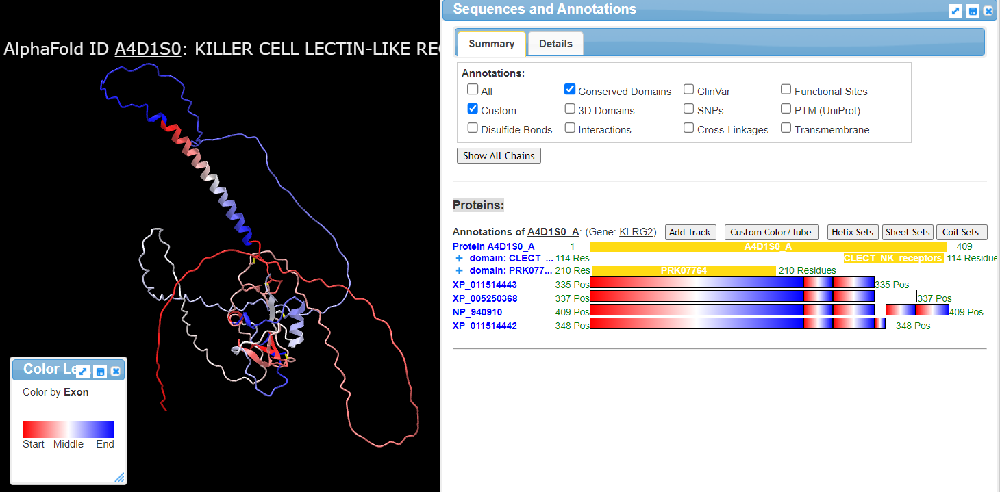

# BOSC CollaborationFest 2023 Report

**CollaborationFest**, CoFest for short, is a collaborative work event that has been held immediately before or after BOSC, continuously over the past 13 years. People are offered to submit their projects in advance (including but not limited to hacking), and then gather in small group to work together and exchange ideas.

The [CoFest 2023](https://www.open-bio.org/events/bosc-2023/obf-bosc-collaborationfest-2023/) took place during the two days just before BOSC, in Lyon, and online.
It was hosted by Jérémy Just at the nearby _[École Normale Supérieure de Lyon](https://www.ens-lyon.fr/en/)_, which provided space and infrastructure, with funding from _[Complex Systems Institute](https://www.ixxi.fr/?set_language=en)_ for lunches and coffee breaks. Virtual machines were made available by the _[French Institute of Bioinformatics](https://www.france-bioinformatique.fr/en/home/)_ and the _[Pôle scientifique de modélisation numérique](https://www.ens-lyon.fr/PSMN/doku.php?id=en:accueil)_.
It brought together 29 in-person participants as well as numerous online participants, experts in fields as diverse as plant biology and personalized medicine.
Many local and first-time attendees were able to join this edition of Cofest.

%%FIXME: Picture of the project list with ecocup and mug

As in previous years, CoFest participants were involved in a wide variety of projects focused on topics such as the documentation of existing software, the review and discussion of novel technologies, the improvement of existing tools, and several FAIR-related projects.
In total, the participants worked on ten different projects, with tangible accomplishments for several subtasks of these projects. In addition, cross-project discussions facilitated progress on many projects, exchanging perspectives and pointers between participants.

Here are some of the advances made during CoFest:

## iCn3D protein viewer

iCn3D is a web-based 3D structure viewer synchronizing 1D, 2D, and 3D view, e.g., https://www.ncbi.nlm.nih.gov/Structure/icn3d/?mmdbid=1TUP&showanno=1&show2d=1. The 1D sequence view shows all kind of annotations (e.g., domains, SNP, etc) in tracks. This project will show the start and end positions of exons in the sequence, and show the sequence of isoforms of the protein and their exons. Thus users can clearly see the exon skipping and potentially relate the exon skipping to the protein functions.

Abstract: iCn3D is a web-based 3D structure viewer synchronizing 1D, 2D, and 3D view, e.g., https://www.ncbi.nlm.nih.gov/Structure/icn3d/?refseqid=NP_001243728.1&showanno=1. The 1D sequence view shows all kind of annotations (e.g., domains, SNP, etc) in tracks. This project will show the start and end positions of exons in the sequence, and show the sequence of isoforms of the protein and their exons. Thus users can clearly see the exon skipping and potentially relate the exon skipping to the protein functions.

In 2023 BOSC Hackathon, [iCn3D viewer](https://www.ncbi.nlm.nih.gov/Structure/icn3d/) got a new feature to show isoforms and exons as tracks with the button "Add Track" in the "Sequences & Annotations" window via the menu "Analysis > Sequences & Annotations". One example is at [https://structure.ncbi.nlm.nih.gov/icn3d/share.html?pA3pPu7LxdiuZDVX7](https://structure.ncbi.nlm.nih.gov/icn3d/share.html?pA3pPu7LxdiuZDVX7):

Users can also predict structures from sequences using ESMFold directly in iCn3D via the menu "File > Predict by Seq. > ESMFold". Other features of iCn3D are listed in its GitHub page: https://github.com/ncbi/icn3d.

## Report updating BLAST book

### Project

The [Blast book](https://www.oreilly.com/library/view/blast/0596002998/), by Ian Korf _et al_, was published in 2003. It provides a lot of "recipes" for Blast searches in different contexts. Since then, however, the syntax of most tools from the Blast suite has changed, with the introduction of Blast+ in 2009. The wrapper currently distributed with Blast+ to convert the old syntax (`blastall`) has quite limited features. My idea is to update the command examples in the book to the new syntax, explain new options, and identify places that need more in-depth updating.

I~ve contacted the main author ([Ian Korf](http://korflab.ucdavis.edu/Bios/bio_ian.html)), and he~s not against a new book about Blast, but he doesn~t want to be involved. I brought two hard copies of the book, in anticipation of CoFest.

### What was done:

 * Scoping discussion on Slack,
 * Side-by-side option table (_old_ vs _new_ options),
 * Practical testing of old examples from the book using the new syntax.

### Future work:

 * Write down the updated examples as a [web page](https://github.com/jejust/blast_book_plus)

## Report on various Biopython projects

Peter Cock will be attending remotely, but as one of the regular Biopython contributors will try to match any newcomers with suitable projects/issues. He hopes to work on migrating the [Tutorial documentation](http://biopython.org/DIST/docs/tutorial/Tutorial.html) from LaTeX to RST to simplify and automate it for each release (see [PR 4371](https://github.com/biopython/biopython/pull/4371)). See the #cofest-biopython channel on the slack.

What was done:
 * Progress on LaTeX to RST/Sphinx conversion of [Tutorial](https://github.com/biopython/biopython/tree/master/Doc) (Tables, Citations)
 * Improvements to a script dealing with big FASTQ files: speed up reads extraction (6x faster).

Future work:
 * Try to get the converted Tutorial to build without errors

Questions to CoFest group:
 * What file format would you prefer for the Tutorial (HTML, PDF, eBook...)?

## Report on MultiK parallelization using future

[MultiK](https://genomebiology.biomedcentral.com/articles/10.1186/s13059-021-02445-5) is a R package built upon [Seurat](https://satijalab.org/seurat/) that objectively selects multiple insightful numbers of clusters (K) in a single-cell RNA-seq dataset.

However the main function of the package is very expensive both in computing and in time since it is not parallelized.

The idea would be to attempt to parallelize it using the [future](https://future.futureverse.org/) package (which is already used by Seurat) in order to speed up scRNA-Seq workflows making use of it.

What was done:
 * The first main loop (out of two) was parallelized
     * works when used locally & remotely on reduced dataset
     * 10x performance for the whole function
 * Crashing using full dataset remotely (`Error: Detected a non-exportable reference ('externalptr') used in the future expression`)

Future work:
 * Investigate the crash further
 * Parallelize the second main loop of MultiK

## Report on project "Bionano tools dependencies extraction from a docker image"

**Project:**

[Bionano](https://bionano.com/) is a technology to create optical maps from HMW DNA. One major problem is the lack of tools options for analysis since there are only tools provided by Bionano Genomics : Bionano Access (server and GUI) and Bionano Solve (analysis software). 
The [installation of Bionano Solve](https://bionano.com/wp-content/uploads/2023/04/CG-30182_Bionano-Solve-Installation-Guide.pdf) is clumsy : it uses a docker image to install dependencies. My idea is to retrieve all the dependencies used from the docker image to create a bioconda recipe in order to easily install and maintain Bionano Solve software dependencies.

**What was done:**
 * Installation of Bionano docker,
 * Inspection of Bionano tools installation script.

**Future work:**
 * Detailed list of dependencies, starting from python / R package and software present in the docker image,
 * (Bio)Conda recipe documentation exploration.

## Report on project: open source LLMs

This group aims to explore the applications and promotion of open source large language models (LLMs) in the field of bioinformatics. LLMs have gained popularity, and the community seeks models that offer accessibility and transparency. Strategies for collaboration and community engagement, including the use of shared repositories and benchmarking frameworks, will be discussed. Ethical considerations such as data privacy, bias, and interpretability will also be explored.

Sharing resources and ideas:
https://docs.google.com/document/d/1fxA3JCtPkScm7vXSFQqPJtgP6OEZgAwN7-o_pKtoH5c/edit?usp=sharing 

What was done:
 * Shared documentation to collect ideas and useful links
     * Tips for choosing/testing open source LLMs
     * Some ideas for applications and benchmarking of the models

Future work:
 * Summarize the document and merge into the paper being prepared by the LLM group from BioHackathon Japan that will be submitted to biohackrxiv
     * https://biohackrxiv.org/discover 
     * http://preview.biohackrxiv.org/ 

## FAIR Biomedical Research Software (FAIR-BioRS)

Most would agree that making biomedical research software (code, scripts, desktop software, Jupyter Notebooks, etc.) reusable is essential to prevent duplicate effort, enable building on top of existing work, and ultimately increase the pace of discoveries and innovations for improving human health. The question then is, how do we make biomedical research software reusable? The Findable, Accessible, Interoperable, and Reusable principles for Research Software (or FAIR4RS principles) published in 2022 provide high-level instructions to achieve that. It is the result of a large-scale effort and is backed by a large community of research software developers. However, just like the original FAIR principles, the FAIR4RS principles remain aspirational and do not provide clear actionable instructions. To address this, we have established the FAIR Biomedical Research Software (FAIR-BioRS) guidelines, that provide clear, actionable step-by-step instructions for making biomedical research software reusable in line with the FAIR4RS principles. Our idea here is to discuss the current version (v2.0.0) of the FAIR-BioRS guidelines, identify if/how they can be improved, brainstorm on how they can be maintained going forward, etc. so as a community we can start adhering consistently with the FAIR4RS principles to make our software reusable and also provide clear guidelines to do so especially for the next generation of biomedical software developers.

What was done:
 * Worked with some attendees to explore how the guidelines would apply to their project
 * Scope discussion, and at least one pull request merged
 * Notes from discussion available at https://etherpad.osuosl.org/p/Cofest2023-fair-BioRS
 * Discussion to wrap up on the paper and plan for future outreach/communication effort

This project had already benefited from BOSC CoFest 2022, and is now published in a peer-reviewed paper: _[Making Biomedical Research Software FAIR](https://doi.org/10.1038/s41597-023-02463-x)._

Future work:
 * Outreach/communication effort

Questions to CoFest group:
 * Would you use the guidelines to make your research software reusable? If not, why, how can they be improved?

## Report on CWL v1.2.1 release work

108 proposed clarifications to the Common Workflow Language v1.2 standards need summarizing

What was done:
 * all done!

See:
 * [Introduction to the CWL Command Line Tool draft standard v1.2.1](https://deploy-preview-262--cwl-v1-2-dev.netlify.app/commandlinetool#Introduction_to_the_CWL_Command_Line_Tool_draft_standard_v1.2.1)
 * [Changelog_for_v1.2.1](https://deploy-preview-262--cwl-v1-2-dev.netlify.app/workflow#Changelog_for_v1.2.1)

Future work
 * Get these changes reviewed & merged

Questions to CoFest group:
 * [reviews](https://github.com/common-workflow-language/cwl-v1.2/pull/262/files) are very welcome! (Especially by those with CWL experience)

## Report on project WR RO-Crate queries

What was done: 
 * Made [SPARQL queries](https://github.com/RenskeW/runcrate-analysis/tree/main/test-prov) to answer provenance questions from ro-crate-manifest.json

Future work: 
 * Add more queries to the list

Questions to CoFest group:
 * How to use SPARQL queries as unit tests?

## WfExS-backend changes to support envvars and get conformant to Workflow Run RO-Crate 0.2

 * Added support to describe environment variables needed by a workflow execution.
 * Integrated used environment variables as inputs in Workflow Run RO-Crate, using FormalParameter. There is no standard way to signal which FormalParameters are a traditional workflow parameter and which are environment variables (besides the id).
 * _(partially implemented)_ Output files and directories are not using an nih URI any more.
 * _(work in progress)_ Better representation of CWL workflow dependencies, so the usage of an external ontology does not appear as a ~hard~ dependency itself.

***We would like to thank the entire BOSC community for maintaining the positive atmosphere that makes such events a success!***
